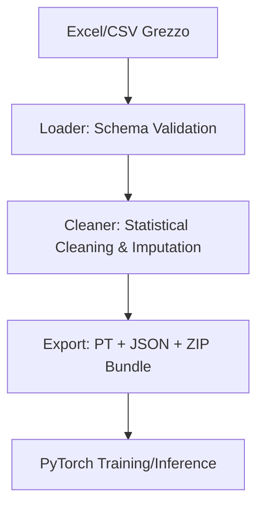

# 🌱 AgriPipe

[](https://github.com/francesco5252/agripipe/actions/workflows/ci.yml)
[](https://pyproject.toml)
[](https://opensource.org/licenses/MIT)

**AgriPipe** è una pipeline ETL (Extract, Transform, Load) professionale per il settore agronomico. Converte file Excel "sporchi" in **ML Bundles** (tensori PyTorch + metadati) pronti per l'addestramento di modelli di Machine Learning, garantendo la massima qualità e integrità del dato numerico.

## 🌟 Architettura ML-Ops

- **Fase 1: Ingestione Infallibile**: Caricamento di Excel/CSV con validazione rigorosa degli schemi tramite Pydantic.
- **Fase 2: Raffineria Dati**: Pulizia statistica automatica, rimozione outlier (IQR/Z-Score) e imputazione intelligente dei dati mancanti (anche tramite interpolazione temporale).
- **Fase 3: Tensorizzazione**: Conversione immediata in matrici PyTorch `float32` perfettamente scalate, con salvataggio dei parametri di normalizzazione per l'inferenza.
- **ML Bundle Exporter**: Genera un pacchetto `.zip` auto-documentato con tensori, metadati JSON e configurazione dello scaler.

## 🚀 Funzionalità Chiave

- **Validazione Schemi**: Controllo immediato di tipi e colonne obbligatorie.
- **Integrità Fisica**: Rimozione di letture sensoriali impossibili basata su preset regionali (12 preset inclusi).
- **ML-Ready**: Trasformazione in `torch.Tensor` con StandardScaler persistibile.
- **Reporting Ingegneristico**: Grafici di distribuzione prima/dopo per validare visivamente il processo di pulizia.

## 🛠 Installazione

```bash
# Clonazione repository
git clone https://github.com/francesco5252/agripipe.git
cd agripipe

# Installazione in modalità sviluppo
pip install -e ".[dev]"
```

## 💻 Utilizzo CLI (Pure Pipeline)

AgriPipe offre un'interfaccia a riga di comando ottimizzata per workflow automatizzati:

### 1. Generazione Tensor con Preset
```bash
agripipe run --input dati.xlsx --preset ulivo_pugliese --output model_input.pt
```

### 2. Export Bundle ML Completo
```bash
agripipe run -i dati.xlsx -p vite_piemontese -e ./export
# Genera .pt, .json e .zip pronti per il caricamento in script di training
```

### 3. Generazione Dati Sintetici
```bash
agripipe generate --rows 1000 --output data/synthetic.xlsx
```

## 🤖 Il Bundle ML (.zip)

Il pacchetto d'uscita è progettato per i team di Data Science:
1. `model.pt`: Tensor di features (normalizzate) e target.
2. `model.json`: Documentazione automatica di ogni colonna e statistiche di pulizia.
3. Esempio di caricamento PyTorch incluso nei metadati.

## 🏗 Workflow Tecnico



## 📄 Licenza

Distribuito sotto licenza MIT. Vedere `LICENSE` per ulteriori informazioni.
