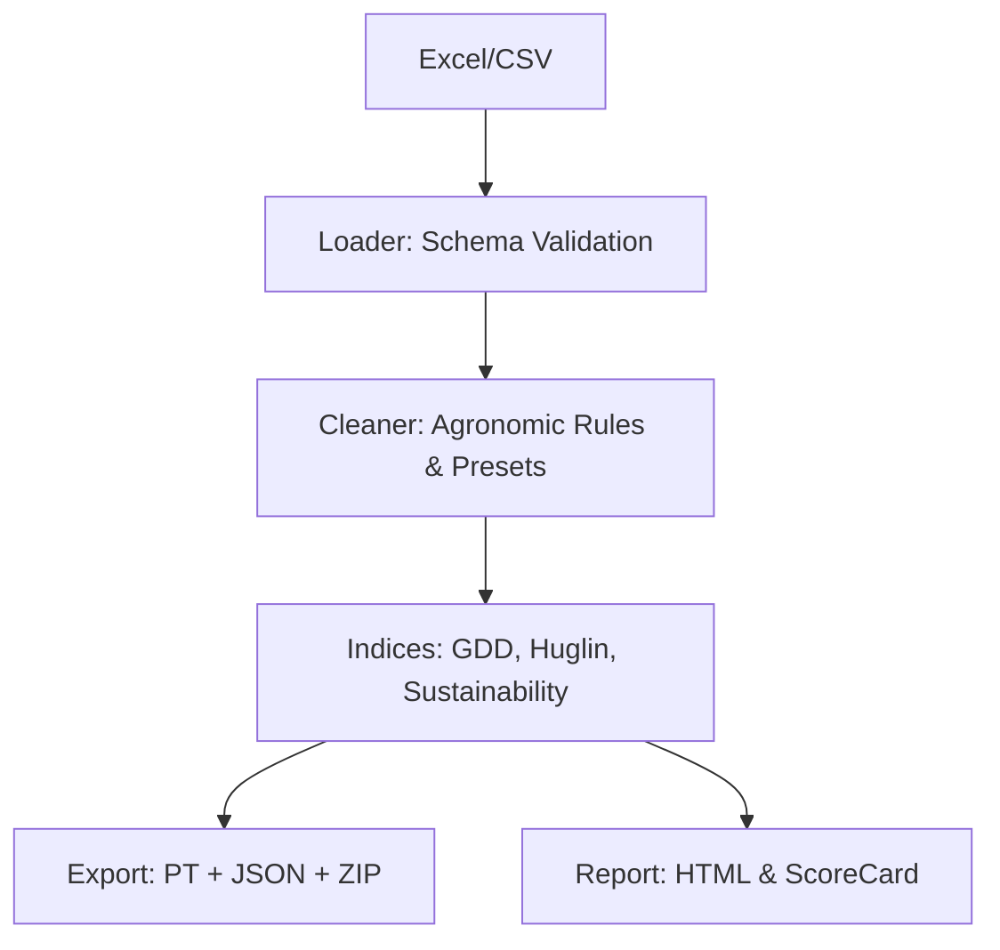

# 🌱 AgriPipe

[](https://github.com/yourusername/agripipe/actions/workflows/ci.yml)
[](https://pyproject.toml)
[](https://opensource.org/licenses/MIT)

**AgriPipe** è una pipeline ETL (Extract, Transform, Load) professionale per il settore agronomico. Converte file Excel "sporchi" in **ML Bundles** (tensori PyTorch + metadati) pronti per il team di Data Science, garantendo al contempo la sostenibilità e la qualità del dato.

## 🌟 Novità Versione Pro

- **Atlante Agronomico**: 12 preset regionali pre-configurati (es. *Olivo DOP Ligure*, *Vite Barolo DOCG*, *Riso Carnaroli*) che applicano regole biologiche e fisiche iper-localizzate.
- **Sustainability Score Card**: Calcolo automatico di indici di sostenibilità (Nitrogen Use Efficiency, Stress Idrico, Salute del Suolo) con visualizzazione a badge (Verde/Arancio/Rosso).
- **ML Bundle Exporter**: Genera automaticamente un pacchetto `.zip` contenente i tensori `.pt`, lo scaler normalizzato e un file `metadata.json` auto-documentato.
- **Indici Avanzati**: Calcolo integrato di Gradi Giorno (GDD), Indice di Huglin e Drought Score a 7 giorni.
- **Interfaccia "Clean & Nature"**: Nuova UI Streamlit moderna, intuitiva e focalizzata sul valore agronomico.

## 🚀 Funzionalità Chiave

- **Validazione Rigorosa**: Utilizzo di **Pydantic** per garantire che i dati carichi rispettino lo schema atteso.
- **Pulizia Intelligente**: Gestione automatica di outlier (IQR, Z-Score), valori mancanti e violazioni dei limiti fisici (es. pH o umidità fuori range).
- **ML-Ready**: Trasformazione immediata in `torch.Tensor` con scaling (Standard/MinMax) e Label Encoding persistibili.
- **Reporting**: Generazione automatica di report HTML per confrontare i dati grezzi con quelli puliti.
- **Configurazione YAML**: Tutta la logica di pulizia è definita in file di configurazione separati dal codice.
- **Logging Professionale**: Supporto per log su console e su file con livelli di dettaglio configurabili.

## 🛠 Installazione

```bash
# Clonazione repository
git clone https://github.com/francesco5252/agripipe.git
cd agripipe

# Installazione in modalità sviluppo
pip install -e ".[dev]"
```

## 💻 Utilizzo CLI (Pro)

AgriPipe Pro offre opzioni avanzate per velocizzare il workflow:

### 1. Eseguire con un Preset Regionale
```bash
agripipe run --input dati.xlsx --preset ulivo_pugliese --report report.html
```

### 2. Esportare un ML Bundle Completo
```bash
agripipe run -i dati.xlsx -p vite_piemontese -o out/model.pt --export-ml ./bundles
# Crea model.pt, model.json e model.zip (pronto per la consegna)
```

### 3. Generare Dati di Test Pro
```bash
# Genera un file ricco di colonne di sostenibilità (Azoto, Suolo, Pioggia)
python -m agripipe.cli generate --output data/pro_sample.xlsx
```

## 🐍 Utilizzo Python API

```python
from agripipe.loader import load_raw
from agripipe.cleaner import AgriCleaner

# 1. Caricamento
df = load_raw("dati_campo.xlsx")

# 2. Pulizia usando un preset territoriale
cleaner = AgriCleaner.from_preset("prosecco_veneto")
df_clean = cleaner.clean(df)

# 3. Accedi ai dati di sostenibilità
stats = cleaner.diagnostics
print(f"Anomalie corrette: {stats.values_imputed}")
```

## 🤖 Il Bundle ML (.zip)

Il team di Data Science riceve un pacchetto completo:
1. `model.pt`: Tensor di features (normalizzate) e target.
2. `model.json`: Documentazione automatica di ogni colonna e contesto agronomico.
3. Esempio di caricamento PyTorch incluso nei metadati.

## 🏗 Architettura



## 📖 Documentazione

La documentazione completa, inclusi i riferimenti API e la guida alla configurazione, è disponibile localmente:

```bash
mkdocs serve
```
Poi visita `http://127.0.0.1:8000`.

## 🧪 Sviluppo e Test

Il progetto segue standard di qualità elevati con una copertura dei test superiore all'80%.

```bash
# Esegui tutti i test (inclusi i test di integrazione E2E)
pytest

# Controllo formattazione
ruff check src
black --check src
```

## 📄 Licenza

Distribuito sotto licenza MIT. Vedere `LICENSE` per ulteriori informazioni.
