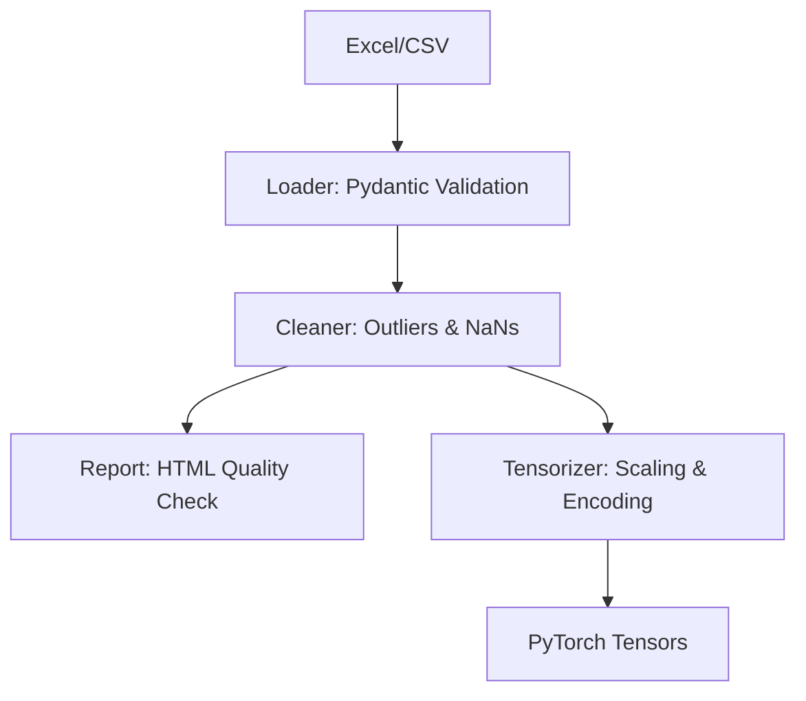

# 🌱 AgriPipe

[](https://github.com/yourusername/agripipe/actions/workflows/ci.yml)
[](https://pyproject.toml)
[](https://opensource.org/licenses/MIT)

**AgriPipe** è una pipeline ETL (Extract, Transform, Load) specializzata per il settore agronomico. È progettata per risolvere il problema comune dei dati "sporchi" in formato Excel, convertendoli in tensori PyTorch pronti per l'addestramento di modelli di Machine Learning.

## 🚀 Funzionalità Chiave

- **Validazione Rigorosa**: Utilizzo di **Pydantic** per garantire che i dati carichi rispettino lo schema atteso.
- **Pulizia Intelligente**: Gestione automatica di outlier (IQR, Z-Score), valori mancanti e violazioni dei limiti fisici (es. pH o umidità fuori range).
- **ML-Ready**: Trasformazione immediata in `torch.Tensor` con scaling (Standard/MinMax) e Label Encoding persistibili.
- **Reporting**: Generazione automatica di report HTML per confrontare i dati grezzi con quelli puliti.
- **Configurazione YAML**: Tutta la logica di pulizia è definita in file di configurazione separati dal codice.
- **Logging Professionale**: Supporto per log su console e su file con livelli di dettaglio configurabili.

## 🛠 Installazione

```bash
# Clonazione repository
git clone https://github.com/yourusername/agripipe.git
cd agripipe

# Installazione in modalità sviluppo
pip install -e ".[dev]"
```

## 💻 Utilizzo CLI

AgriPipe offre un'interfaccia a riga di comando potente e intuitiva.

### 1. Eseguire la Pipeline Completa
```bash
agripipe run --input data/raw.xlsx --output out/tensors.pt --report out/report.html
```

### 2. Validare la Configurazione
```bash
agripipe check --config configs/default.yaml
```

### 3. Generare Dati Sintetici (per Test)
```bash
agripipe generate --rows 1000 --output data/test_data.xlsx
```

### 4. Opzioni Globali
- `--log-file path/to/log.txt`: Salva l'esecuzione su file.
- `--verbose / -v`: Abilita i log di debug.

## 🐍 Utilizzo Python API

```python
from agripipe.loader import load_raw
from agripipe.cleaner import AgriCleaner
from agripipe.dataset import AgriDataset

# 1. Caricamento
df = load_raw("dati_campo.xlsx")

# 2. Pulizia
cleaner = AgriCleaner.from_yaml("configs/default.yaml")
df_clean = cleaner.clean(df)

# 3. Dataset PyTorch
dataset = AgriDataset(
    df_clean, 
    numeric_columns=["temp", "humidity"], 
    target="yield"
)

# 4. Pronto per il DataLoader
from torch.utils.data import DataLoader
loader = DataLoader(dataset, batch_size=32, shuffle=True)
```

## 🏗 Architettura



## 📖 Documentazione

La documentazione completa, inclusi i riferimenti API e la guida alla configurazione, è disponibile localmente:

```bash
mkdocs serve
```
Poi visita `http://127.0.0.1:8000`.

## 🧪 Sviluppo e Test

Il progetto segue standard di qualità elevati con una copertura dei test superiore all'80%.

```bash
# Esegui tutti i test (inclusi i test di integrazione E2E)
pytest

# Controllo formattazione
ruff check src
black --check src
```

## 📄 Licenza

Distribuito sotto licenza MIT. Vedere `LICENSE` per ulteriori informazioni.
