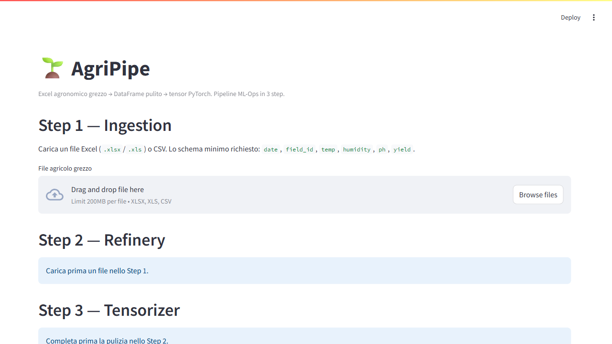

# 🌱 AgriPipe

[](https://github.com/francesco5252/agripipe/actions/workflows/ci.yml)
[](https://www.python.org/)
[](LICENSE)
[](https://github.com/psf/black)

**Da Excel agronomico sporco a tensor PyTorch validati. Tre step, riproducibili, tracciabili.**

> 🇬🇧 English version: [README.en.md](README.en.md)

---

## 🎯 Per chi è questo progetto

AgriPipe nasce per colmare un vuoto concreto nel mondo dell'agricoltura digitale: la distanza fra i **dati raccolti in campo** (sensori, registri cartacei digitalizzati, fogli Excel compilati a mano) e il **formato rigido richiesto dai modelli di Machine Learning**.

È pensato per tre profili di utente:

- **👨‍🔬 Data scientist e ricercatori agritech** che ricevono Excel agronomici di qualità variabile e devono trasformarli in dataset ML-ready in modo riproducibile.
- **🎓 Studenti di agronomia, scienze ambientali e agricoltura sostenibile** che vogliono portare un dataset reale a un modello PyTorch senza scrivere codice di pulizia da zero.
- **🌾 Operatori agritech e sviluppatori di aziende del settore** (come X Farm) che hanno bisogno di una pipeline prevedibile e auditabile per alimentare i propri modelli di previsione della resa.

Non serve essere esperti di PyTorch per usarlo: la UI Streamlit copre tutto il flusso con pochi click.

---

## 💡 Il problema che risolve

Un Excel agronomico tipico è un campo minato:

- Date in formato *seriale Excel* (`45123` invece di `2024-01-15`).
- Umidità registrata come `150%` (impossibile fisicamente).
- Tre o quattro righe di intestazione aziendale prima del vero header.
- Righe duplicate per errori di sincronizzazione dei sensori.
- Valori separatore decimale `,` invece di `.` (retaggio italiano).
- NaN sparsi ovunque, a volte indicati con `-`, `n.d.`, o celle vuote.

Fare Machine Learning su dati così richiede **ore di pulizia manuale** e introduce bug silenziosi difficili da rintracciare. AgriPipe automatizza tutto il processo in una pipeline trasparente a 3 step, generando un bundle `.zip` auto-documentato con tensor PyTorch, metadata JSON e parametri dello scaler pronti per la fase di training o inferenza.

---

## 🚀 Come si usa

AgriPipe offre due modalità d'uso, entrambe supportate:

### 🖥 Via UI Streamlit (consigliato per esplorare)

```bash
streamlit run app.py
```

Si apre una web app a 3 step: carichi il file, configuri la pulizia, scarichi il bundle `.zip`. Zero righe di codice.



### ⚙️ Via CLI (consigliato per pipeline automatiche)

```bash
# Pulizia + tensorizzazione con preset regionale
agripipe run --input dati.xlsx --preset ulivo_pugliese --output model_input.pt

# Export bundle ML completo (.pt + .json + .zip)
agripipe run -i dati.xlsx -p vite_piemontese -e ./export/

# Generazione di dati sintetici per test
agripipe generate --rows 1000 --output data/synthetic.xlsx
```

Esegui `agripipe --help` per la lista completa dei comandi.

---

## 📦 Cosa produce

Alla fine della pipeline ottieni un archivio **`<nome>.zip`** che contiene:

| File | Contenuto |
|------|-----------|
| `<nome>.pt` *(o `<nome>_train.pt`, `_val.pt`, `_test.pt` se attivi lo split)* | Bundle PyTorch con `features`, `target`, `feature_names`, `scaler_mean`, `scaler_scale`, `metadata` |
| `<nome>.json` | Manifest completo: schema, unità, statistiche per colonna, correlazioni, diagnostica pulizia, esempio PyTorch |

Il tutto è tracciabile: il `metadata.json` include l'hash SHA-256 del file sorgente e uno `schema_lock_hash` che ti permette di verificare quando un dataset cambia forma.

### Caricamento in PyTorch (5 righe)

```python
import torch
from torch.utils.data import TensorDataset, DataLoader

bundle = torch.load("agripipe_export.pt", weights_only=False)
dataset = TensorDataset(bundle["features"], bundle["target"])
loader = DataLoader(dataset, batch_size=32, shuffle=True)
```

Il modello PyTorch è pronto per l'addestramento senza ulteriori trasformazioni.

---

## 🏗 Come funziona: i 3 step

```
┌─────────────┐   ┌─────────────┐   ┌──────────────┐   ┌────────────────┐
│ Excel / CSV │──▶│  1. LOADER  │──▶│  2. CLEANER  │──▶│ 3. TENSORIZER  │──▶ .pt + .json + .zip
└─────────────┘   └─────────────┘   └──────────────┘   └────────────────┘
                    schema          imputazione         scaling
                    validation      outlier (IQR/Z)     encoding cat.
                    SHA-256 hash    limiti fisici       train/val/test
```

1. **Loader** — legge Excel (`.xlsx`/`.xls`) o CSV, riconosce intestazioni sporche, normalizza le date (incluse quelle in formato seriale Excel), valida lo schema minimo (`date`, `field_id`, `temp`, `humidity`, `ph`, `yield`) e calcola un fingerprint SHA-256 per la tracciabilità.

2. **Cleaner** — applica in ordine: coercizione tipi → limiti fisici configurabili → rilevamento outlier (IQR o Z-score) → imputazione valori mancanti (media, mediana, forward-fill, interpolazione temporale) → deduplica. Tutte le operazioni sono contate e riportate nei diagnostics.

3. **Tensorizer** — scala le feature numeriche (`StandardScaler` o `RobustScaler`), codifica le categoriche (`LabelEncoder` o `OneHotEncoder`), crea il tensor PyTorch e opzionalmente divide in train/val/test.

Ogni step produce un output interrogabile e auditabile: non è una scatola nera.

---

## 🛠 Installazione

```bash
# Clona il repository
git clone https://github.com/francesco5252/agripipe.git
cd agripipe

# Installa in modalità sviluppo (include dipendenze di test)
pip install -e ".[dev]"
```

Requisiti: **Python 3.10+**, sistema operativo qualsiasi (testato su Windows, Linux, macOS).

---

## 🧪 Sviluppo e test

Il progetto segue una disciplina TDD con test rigorosi:

```bash
pytest                        # 38 test, ~82% coverage
ruff check src tests app.py    # linting
black --check src tests app.py # formattazione
```

La CI GitHub Actions esegue automaticamente test + lint su Python 3.10, 3.11 e 3.12 a ogni push.

---

## ⚠️ Limiti noti (onestà intellettuale)

Conoscere i limiti di uno strumento è parte della sua qualità. AgriPipe **non fa**:

- **Fuzzy matching dei nomi colonna** — lo schema minimo (`date`, `field_id`, `temp`, `humidity`, `ph`, `yield`) è obbligatorio. Se nel tuo Excel la colonna si chiama `Temperatura_C`, devi rinominarla prima.
- **Conversione di unità di misura** — niente Fahrenheit → Celsius, niente pollici → mm. I dati si assumono già nelle unità canoniche (SI dove possibile).
- **Batch loading da cartelle** — un file alla volta. La combinazione di più file è una scelta di workflow esterno.
- **Modelli agronomici interpretativi** — nessun indice di sostenibilità, nessuna scorecard "green/yellow/red". AgriPipe produce dati puliti, non giudizi agronomici. Questa era una scelta di design: separare la preparazione del dato dall'interpretazione.
- **Imputazione ML-based (KNN, MICE)** — resta su metodi statistici classici per trasparenza e riproducibilità.

Queste esclusioni sono **intenzionali**: mantengono la pipeline prevedibile, debuggabile e facile da validare scientificamente.

---

## 📄 Licenza

Distribuito sotto licenza **MIT**. Vedere il file [`LICENSE`](LICENSE) per i dettagli.

---

<sub>Progetto sviluppato con un approccio ML-Ops rigoroso. Per il percorso di sviluppo completo passo-passo, consulta [`DOCUMENTAZIONE_LOG.md`](DOCUMENTAZIONE_LOG.md).</sub>
